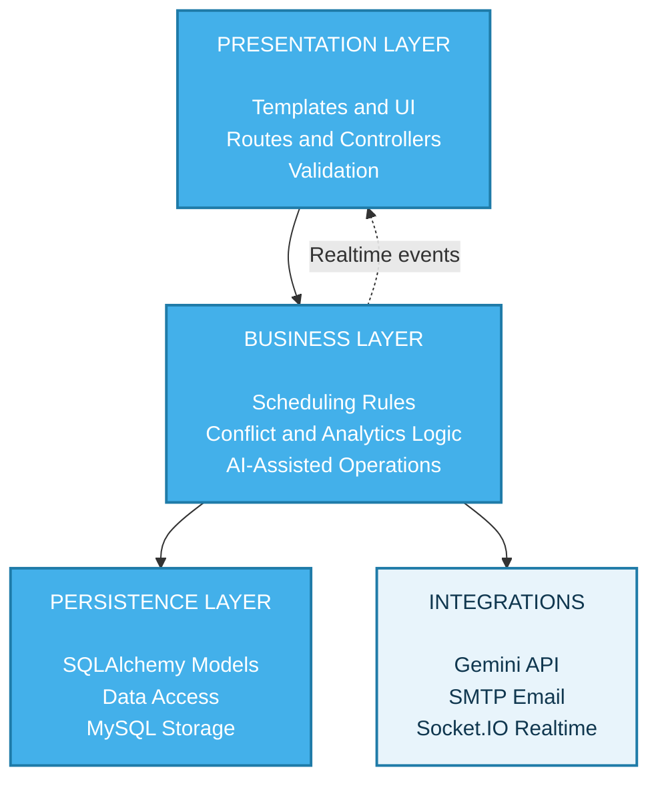
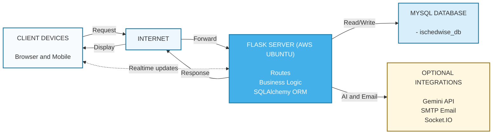

# iSchedWise V4 - Architecture Views

> Thesis Appendix C - Section 3.0: System Architecture
>
> This chapter provides two architecture views based on the implemented system:
> 1. Layered Architecture (internal organization)
> 2. Client-Server Architecture (runtime communication)

---

## 1. Layered Architecture

### 1.1 Scope

This is a simplified 3-layer view of iSchedWise V4 from UI to database.
It keeps only the essential components for thesis presentation.

### 1.2 Copy-Ready Layer Labels

Use these labels directly in your thesis figure.

#### PRESENTATION LAYER
- Templates and UI (Jinja2, JS, CSS)
- Flask routes and controllers
- User input and request validation

#### BUSINESS LAYER
- Scheduling workflows and rules
- Conflict checks, reports, and analytics
- AI-assisted recommendations and system operations

#### PERSISTENCE LAYER
- SQLAlchemy models and data access
- MySQL database storage
- Archives, logs, and backups

### 1.3 Mermaid Reference (Editable)

Use this as an editable technical reference. You can still produce the final thesis figure in Canva, PowerPoint, or Figma.

### 1.4 Implementation Mapping

| Layer | Main Components | Primary Implementation Files |
|---|---|---|
| Presentation | Routes, templates, static UI | [app/routes/](../../app/routes/), [app/templates/](../../app/templates/), [app/static/](../../app/static/) |
| Business | Services, rules, AI logic | [app/services/](../../app/services/), [app/ai_scheduler.py](../../app/ai_scheduler.py), [app/utils/](../../app/utils/) |
| Persistence | Models, ORM session, schema | [app/models/](../../app/models/), [app/extensions.py](../../app/extensions.py), [ischedwise_db.sql](../../ischedwise_db.sql) |

---

## 2. Client-Server Architecture

### 2.1 Scope

This view describes runtime communication between clients and the deployed Flask system on AWS Ubuntu.
It includes standard request-response traffic and real-time Socket.IO events.

### 2.2 Copy-Ready Labels

Use these labels directly in your thesis figure.

- CLIENT DEVICES
  - Browser and Mobile
- INTERNET
- FLASK SERVER (AWS UBUNTU)
- MYSQL DATABASE (ischedwise_db)
- OPTIONAL INTEGRATIONS
  - Gemini API
  - SMTP Email
  - Socket.IO Realtime

### 2.3 Mermaid Reference (Editable)

### 2.4 Request and Event Flow Notes

1. Client sends a request through the internet to the Flask server.
2. The server applies authentication, validation, and business rules.
3. The app reads or writes MySQL through SQLAlchemy.
4. The server returns the response, and optional realtime or external integrations run when needed.

---

## 3. Image-First Figure Build Guide

This section matches the style direction from your sample images.

### 3.1 Canvas and Styling

- Canvas: 1920 x 1080 (16:9) or 1366 x 768
- Background: light gray (#ececec)
- Primary cards: bright azure blue (#43b0ea)
- Card corner radius: 30 to 44 px
- Card shadow: 0 12 20 rgba(0, 0, 0, 0.20)
- Heading font: Cinzel or Cormorant SC (uppercase with wide letter spacing)
- Body font: Cormorant Garamond or Libre Baskerville
- Main text color: near-black (#1c1c1c)
- On-card text color: white (#ffffff)

### 3.2 Layered Figure Layout

1. Place title at top center: LAYERED ARCHITECTURE.
2. Add subtitle on left under title: OVERVIEW.
3. Create three horizontal rounded cards stacked with equal spacing:
   - Top card: PRESENTATION LAYER
   - Middle card: BUSINESS LAYER
   - Bottom card: PERSISTENCE LAYER
4. Put bullet list details on the right side of each card.
5. Keep each card height consistent for visual balance.
6. Export as PNG (300 DPI) for thesis insertion.

### 3.3 Client-Server Figure Layout

1. Place title at top center: CLIENT SERVER ARCHITECTURE.
2. Place subtitle under title: CLIENT (BROWSER) -> INTERNET NETWORK -> AWS UBUNTU WEB HOST (FLASK).
3. Left side: desktop and mobile icons labeled CLIENT DEVICES.
4. Center: network/tower icon labeled INTERNET NETWORK.
5. Right side: cloud/server icon labeled AWS UBUNTU WEB HOST.
6. Add large arrow rightward (REQUEST) from client side to server side.
7. Add large arrow leftward (RESPONSE) from server side back to client side.
8. Add one optional integration callout (Gemini, SMTP, Socket.IO) linked to host.
9. Export as PNG (300 DPI) and SVG (editable).

---

## 4. Accuracy Notes (Implementation Anchors)

- Blueprint route registration is centralized in [app/routes/__init__.py](../../app/routes/__init__.py) and initialized in [app/__init__.py](../../app/__init__.py).
- Realtime communication is handled through Flask-SocketIO events in [app/routes/socket_events.py](../../app/routes/socket_events.py) and served via [run.py](../../run.py).
- AI flows are provided by [app/ai_scheduler.py](../../app/ai_scheduler.py), with route-level usage in schedule, exam schedule, and reports handlers.
- Email delivery uses Flask-Mail initialized in [app/extensions.py](../../app/extensions.py), with route-level sending in authentication and admin email test flows.
- Persistence source of truth remains [ischedwise_db.sql](../../ischedwise_db.sql), mirrored by SQLAlchemy models in [app/models/](../../app/models/).
