# iSchedWise V4 — Data Flow Diagrams

> **Thesis Appendix C — Section 3.2: Data Flow Diagram (DFD)**
>
> Diagrams are presented at three levels: **Context Diagram (Level 0)**, **Level 1 DFD** (main processes), and **Level 2 DFDs** (process decompositions). The visual style follows the thesis reference format: external entities are **tagged rectangles**, processes are **numbered process cards** (number, action, owner lane), data stores are **ID-labeled repositories**, and flows are labeled arrows.

> **See also:** [THESIS_ARCHITECTURE.md](THESIS_ARCHITECTURE.md) for client-server and container architecture views.

---

## Data Stores Reference

| ID | Name | Description |
|----|------|-------------|
| D1 | Users | User accounts, roles, credentials, program access, and trusted-device auth state |
| D2 | Schedules | Class and exam schedules, including schedule snapshot state |
| D3 | Faculty | Faculty profiles, availability, and subject assignments |
| D4 | Buildings & Rooms | Building info, room types and capacities |
| D5 | Programs & Sections | Programs, sections, and departments |
| D6 | Curriculum & Subjects | Curricula, year levels, semesters, and subjects |
| D7 | Settings | Academic config, institution profile, system configuration, and user preferences |
| D8 | Activity Logs | Audit trail and system event logs |
| D9 | Archive Records | Archived schedules, faculty, programs, curricula, buildings |
| D10 | Login History | Login sessions, logout records, and access history |

---

## Process Reference

| # | Process | Description |
|---|---------|-------------|
| 1 | User Authentication | Login, session management, first-login setup |
| 2 | Schedule Management | Class & exam schedule create/edit/delete/export |
| 3 | Faculty Management | Faculty CRUD, assignments, availability, archive |
| 4 | Building & Room Management | Building and room CRUD, archive |
| 5 | Program & Section Management | Programs, sections, and department CRUD |
| 6 | Curriculum Management | Curricula, subjects, year levels, bulk import |
| 7 | Report Generation | All report types, filters, PDF/Excel export |
| 8 | System Settings & Operations | Academic/institution settings, department config, maintenance, security sessions, and database tools |
| 9 | User Management | User CRUD, roles, access control, bulk operations |
| 10 | Archive Management | View, restore, delete, export archived entities |
| 11 | Profile Management | Self-service profile update and password change for all roles |

---

## Context Diagram (Level 0)

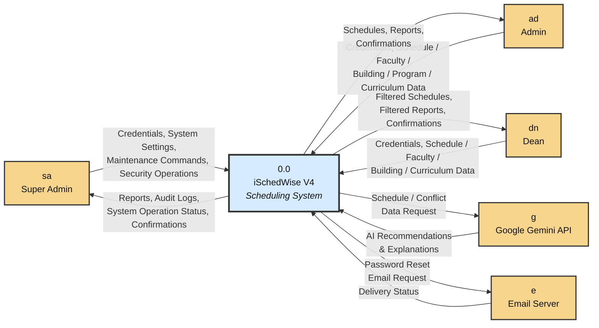

---

## Level 1 DFD

> *Simplified overview showing primary data flows. All write-capable processes also log to D8 (Activity Logs) upon completion.*

```mermaid
flowchart TD
    SA["sa<br/>Super Admin"]
    AD["ad<br/>Admin"]
    DN["dn<br/>Dean"]

    P1["1.0<br/>User Authentication<br/><i>Authentication</i>"]
    P2["2.0<br/>Schedule Management<br/><i>Scheduling</i>"]
    P3["3.0<br/>Faculty Management<br/><i>Faculty</i>"]
    P4["4.0<br/>Building & Room Management<br/><i>Facilities</i>"]
    P5["5.0<br/>Program & Section Management<br/><i>Programs</i>"]
    P6["6.0<br/>Curriculum Management<br/><i>Curriculum</i>"]
    P7["7.0<br/>Report Generation<br/><i>Reporting</i>"]
    P8["8.0<br/>System Settings & Operations<br/><i>Operations</i>"]
    P9["9.0<br/>User Management<br/><i>Administration</i>"]
    P10["10.0<br/>Archive Management<br/><i>Archive</i>"]
    P11["11.0<br/>Profile Management<br/><i>User Profile</i>"]

    D1["D1<br/>Users"]
    D2["D2<br/>Schedules"]
    D3["D3<br/>Faculty"]
    D4["D4<br/>Buildings & Rooms"]
    D5["D5<br/>Programs & Sections"]
    D6["D6<br/>Curriculum & Subjects"]
    D7["D7<br/>Settings"]
    D8["D8<br/>Activity Logs"]
    D9["D9<br/>Archive Records"]
    D10["D10<br/>Login History"]

    SA --> P1 & P2 & P3 & P4 & P5 & P6 & P7 & P8 & P9 & P10 & P11
    AD --> P1 & P2 & P3 & P4 & P5 & P6 & P7 & P8 & P9 & P10 & P11
    DN --> P1 & P2 & P3 & P4 & P5 & P6 & P7 & P8 & P10 & P11

    P1 & P7 & P8 & P9 & P11 --- D1
    P1 & P8 --- D10

    P2 & P3 & P4 & P5 & P6 & P7 & P8 & P10 --- D2
    P2 & P3 & P7 & P8 & P10 --- D3
    P2 & P4 & P7 & P10 --- D4
    P2 & P3 & P5 & P6 & P7 & P8 & P9 & P10 --- D5
    P2 & P3 & P5 & P6 & P7 & P10 --- D6
    P2 & P3 & P6 & P7 & P8 --- D7

    P8 & P10 --- D9
    P1 & P2 & P3 & P4 & P5 & P6 & P7 & P8 & P9 & P10 & P11 --- D8

    classDef entity fill:#f7d58c,stroke:#333,stroke-width:2px,color:#111;
    classDef process fill:#f5f5f5,stroke:#333,stroke-width:2px,color:#111;
    classDef store fill:#ffffff,stroke:#333,stroke-width:2px,color:#111;

    class SA,AD,DN entity;
    class P1,P2,P3,P4,P5,P6,P7,P8,P9,P10,P11 process;
    class D1,D2,D3,D4,D5,D6,D7,D8,D9,D10 store;
```

---

## Level 2 — Process 1: User Authentication

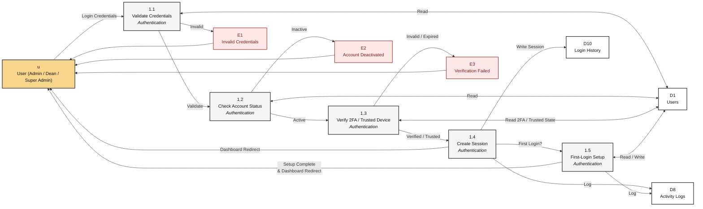

---

## Level 2 — Process 2: Schedule Management

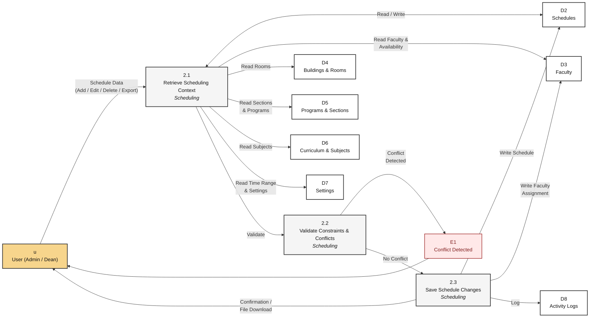

---

## Level 2 — Process 3: Faculty Management

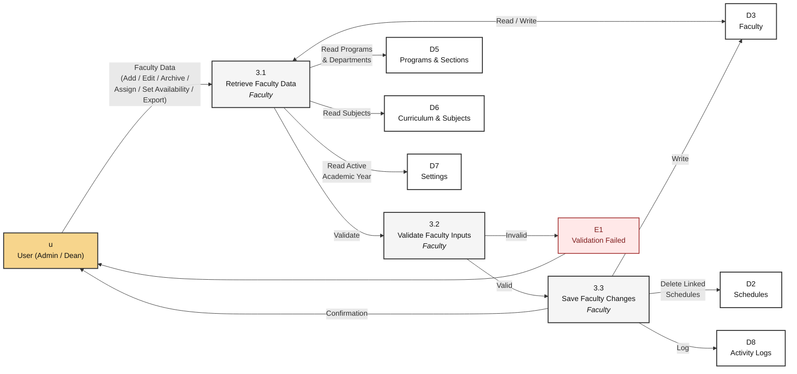

---

## Level 2 — Process 4: Building & Room Management

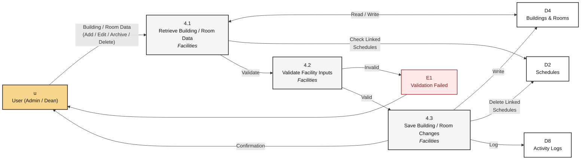

---

## Level 2 — Process 5: Program & Section Management

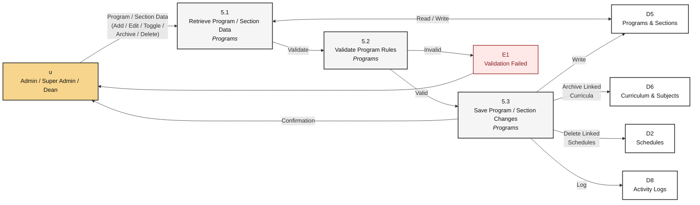

---

## Level 2 — Process 6: Curriculum Management

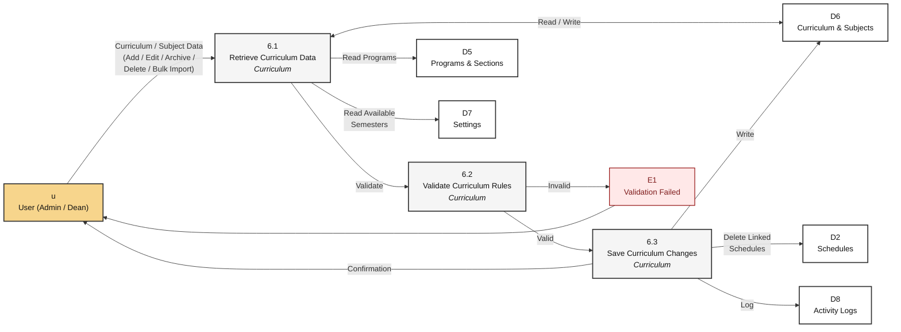

---

## Level 2 — Process 7: Report Generation

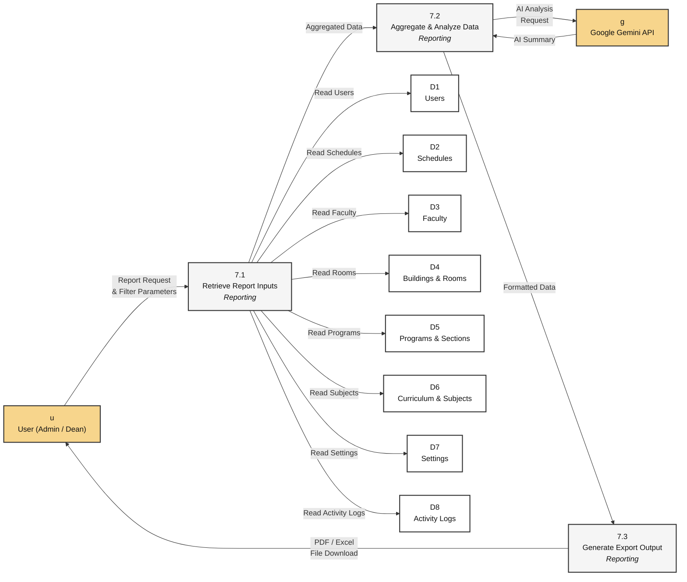

---

## Level 2 — Process 8: System Settings & Operations

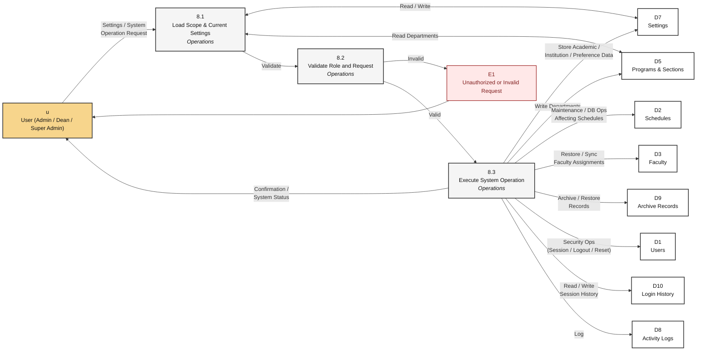

---

## Level 2 — Process 9: User Management

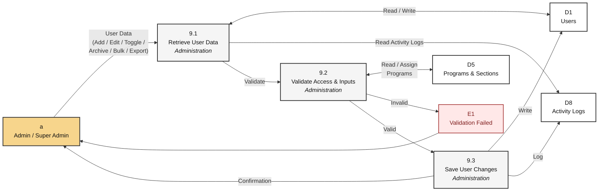

---

## Level 2 — Process 10: Archive Management

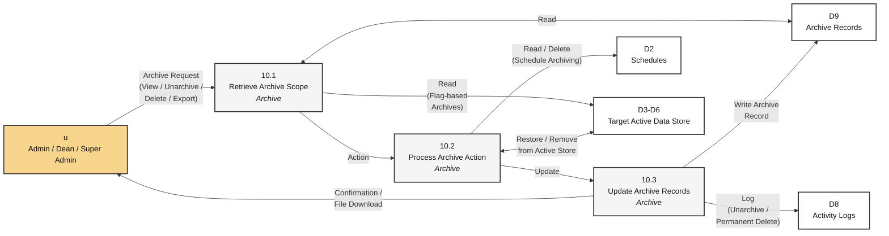

---

## Level 2 — Process 11: Profile Management

> All roles (Super Admin, Admin, Dean) can update their own profile and change their password.

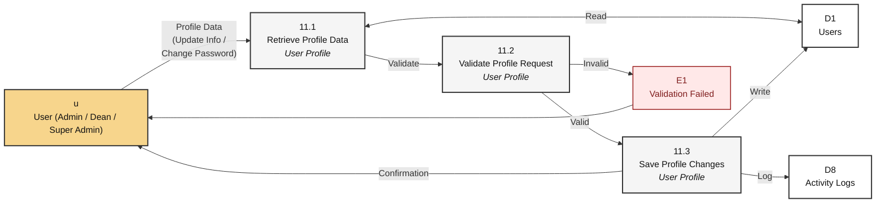

---

## Notation Legend

| Shape | Notation | Meaning |
|-------|----------|---------|
| Tagged Rectangle | `["id Entity Name"]` | External Entity — actor or system outside the iSchedWise process boundary |
| Process Card | `["1.x Process Action <i>Owner Lane</i>"]` | Process — numbered operation with responsible module/lane |
| Repository Block | `["D# Store Name"]` | Data Store — persistent repository (Mermaid approximation of open-ended store) |
| Rectangle | `[...]` | Data Element / Error Output |
| Labeled Arrow | `-->` | Data Flow — movement of data between elements |

> Note: Mermaid does not fully support the split-tab and open-ended store glyphs from the thesis image, so this document uses a close visual approximation while preserving the same DFD semantics.

---

*Generated for iSchedWise V4 — Thesis Appendix C, Section 3.2*
