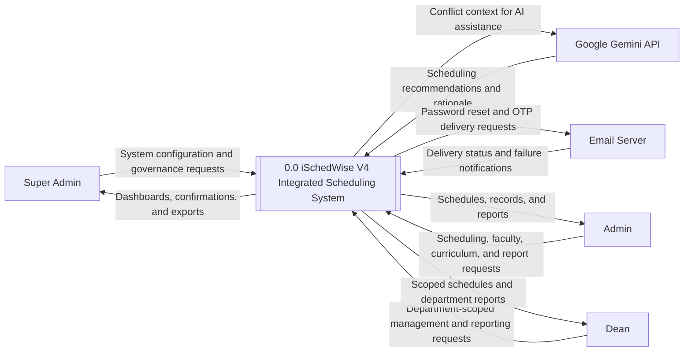
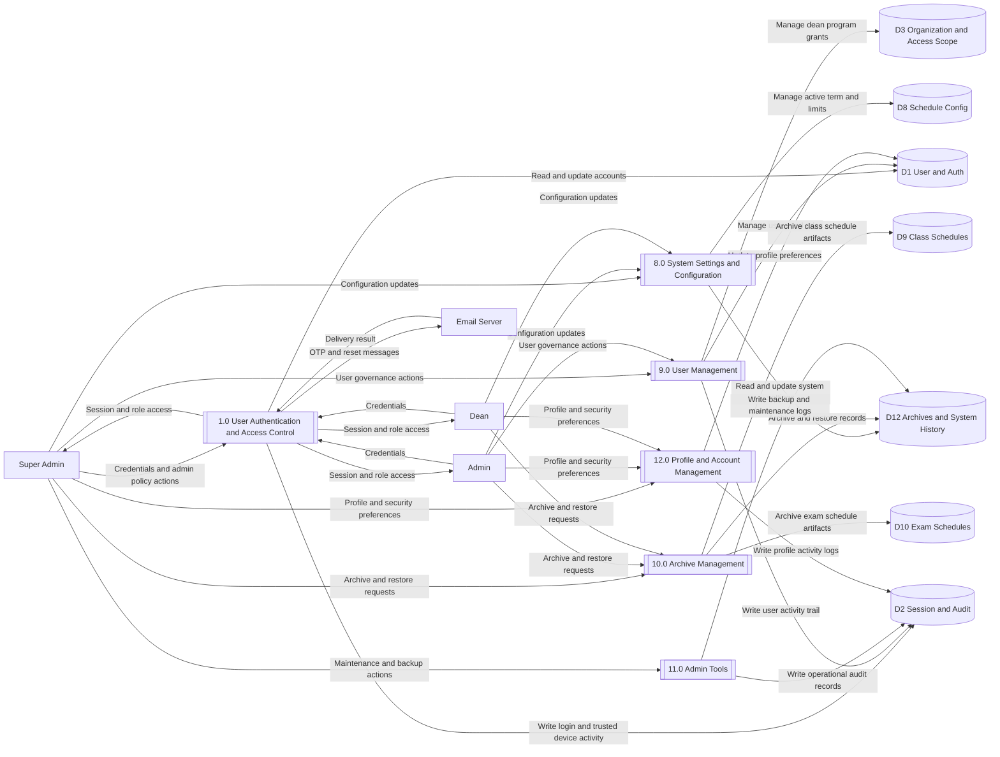
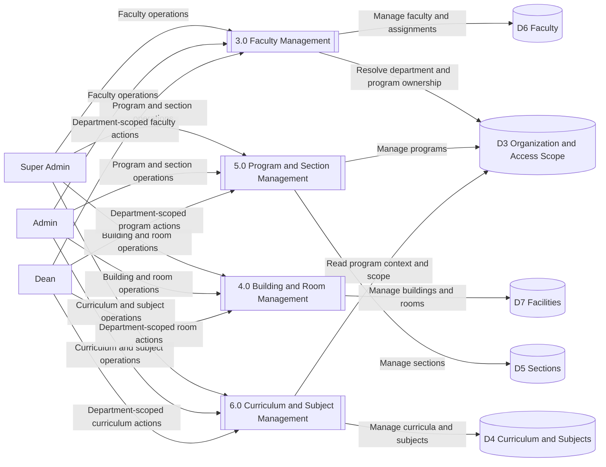
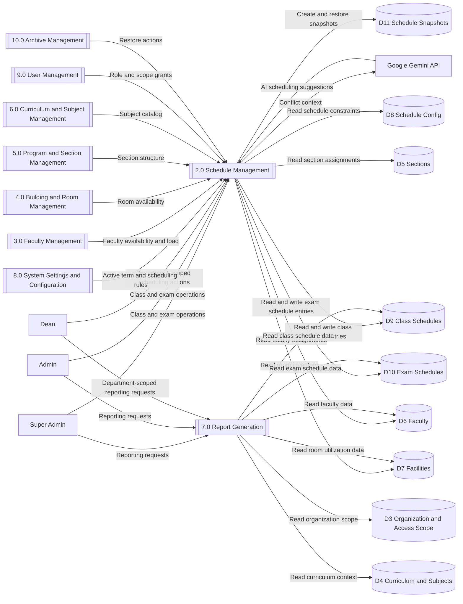

# iSchedWise V4 - Gane-Sarson DFD in Mermaid

This file provides Mermaid equivalents for your Gane-Sarson DFD notation and system-level diagrams.

## Gane-Sarson to Mermaid Legend

| Gane-Sarson Element | Mermaid Syntax | Visual Description |
|---|---|---|
| External Entity | `ID[Name]` | Square corner box |
| Process | `ID[[1.0 Name]]` | Rounded/subroutine box |
| Data Store | `ID[(Name)]` | Cylindrical/database shape |
| Data Flow | `-->|Data Label|` | Labeled directional arrow |

## Level 0 Context Diagram

## Level 1 Diagram (Split Views for Readability)

The full Level 1 model is split into focused views so each diagram stays readable while preserving the same thesis-aligned process IDs (1.0 to 12.0).

### Level 1A - Access, Identity, and Governance

### Level 1B - Academic Master Data Management

### Level 1C - Scheduling, AI Assistance, and Reporting

## Connector-to-Process Coverage Check

The table below documents parity between the thesis connector matrix in THESIS_FLOWCHARTS.md and this split Level 1 DFD.

| Connector | Thesis Module | DFD Process | Expected Role Access | Modeled Role Access | Status |
|---|---|---|---|---|---|
| C | Schedule Management | 2.0 Schedule Management | Super Admin, Admin, Dean | Super Admin, Admin, Dean | Aligned |
| D | Faculty Management | 3.0 Faculty Management | Super Admin, Admin, Dean | Super Admin, Admin, Dean | Aligned |
| E | Building and Room Management | 4.0 Building and Room Management | Super Admin, Admin, Dean | Super Admin, Admin, Dean | Aligned |
| F | Programs and Sections | 5.0 Program and Section Management | Super Admin, Admin, Dean | Super Admin, Admin, Dean | Aligned |
| G | Curriculum and Subjects | 6.0 Curriculum and Subject Management | Super Admin, Admin, Dean | Super Admin, Admin, Dean | Aligned |
| H | Reports Generation | 7.0 Report Generation | Super Admin, Admin, Dean | Super Admin, Admin, Dean | Aligned |
| I | System Settings | 8.0 System Settings and Configuration | Super Admin, Admin, Dean | Super Admin, Admin, Dean | Aligned |
| J | User Management | 9.0 User Management | Super Admin, Admin | Super Admin, Admin | Aligned |
| K | Archive Management | 10.0 Archive Management | Super Admin, Admin, Dean | Super Admin, Admin, Dean | Aligned |

Action-level restrictions still apply inside modules even when entry-level connector access is shared.

## Process-to-Route Traceability

| Process ID | Process Name | Primary Route Module |
|---|---|---|
| 1.0 | User Authentication and Access Control | `app/routes/auth.py` |
| 2.0 | Schedule Management | `app/routes/schedule.py`, `app/routes/exam_schedule.py` |
| 3.0 | Faculty Management | `app/routes/faculty.py` |
| 4.0 | Building and Room Management | `app/routes/building.py` |
| 5.0 | Program and Section Management | `app/routes/program.py` |
| 6.0 | Curriculum and Subject Management | `app/routes/curriculum.py` |
| 7.0 | Report Generation | `app/routes/reports.py` |
| 8.0 | System Settings and Configuration | `app/routes/settings.py` |
| 9.0 | User Management | `app/routes/user.py` |
| 10.0 | Archive Management | `app/routes/archive.py` |
| 11.0 | Admin Tools | `app/routes/admin_tools.py` |
| 12.0 | Profile and Account Management | `app/routes/profile.py` |
