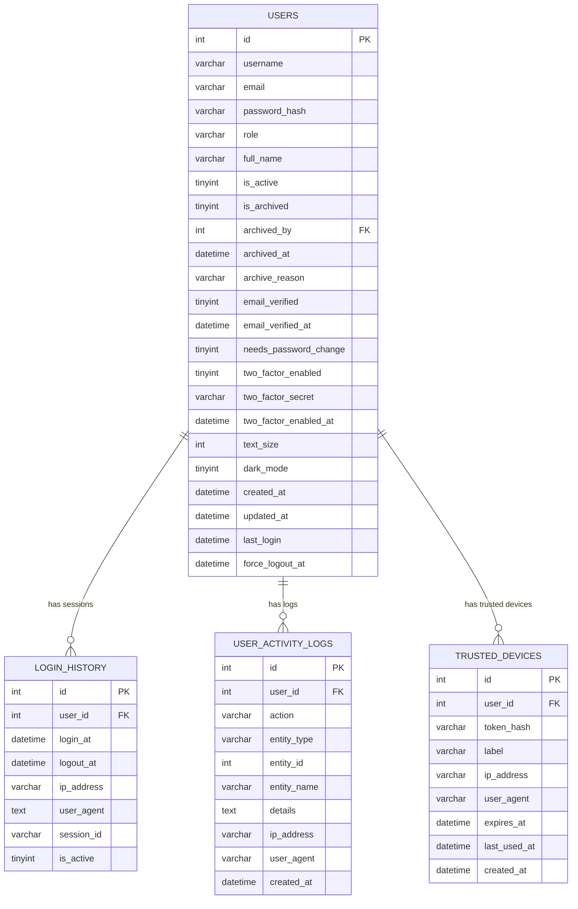
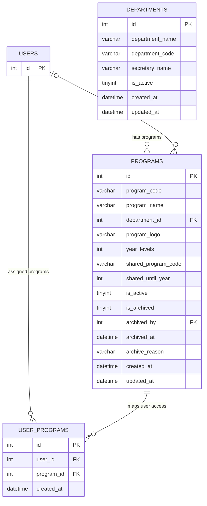
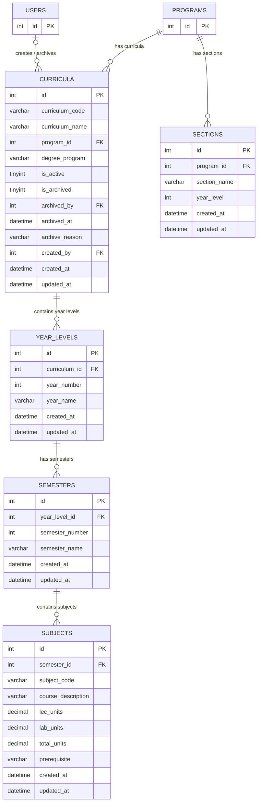
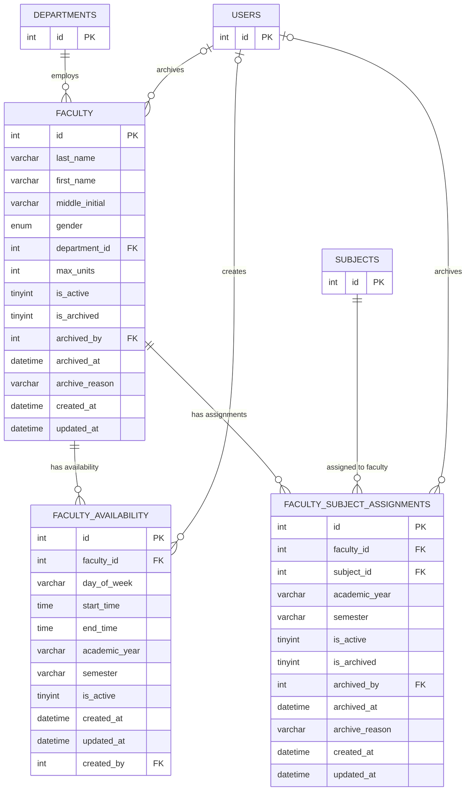
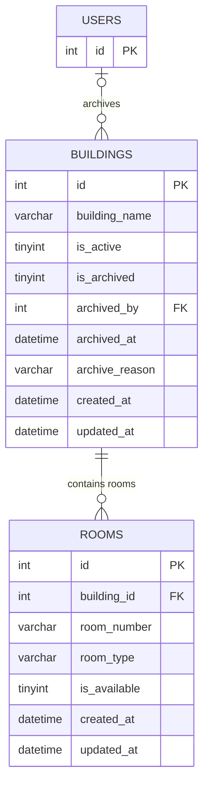
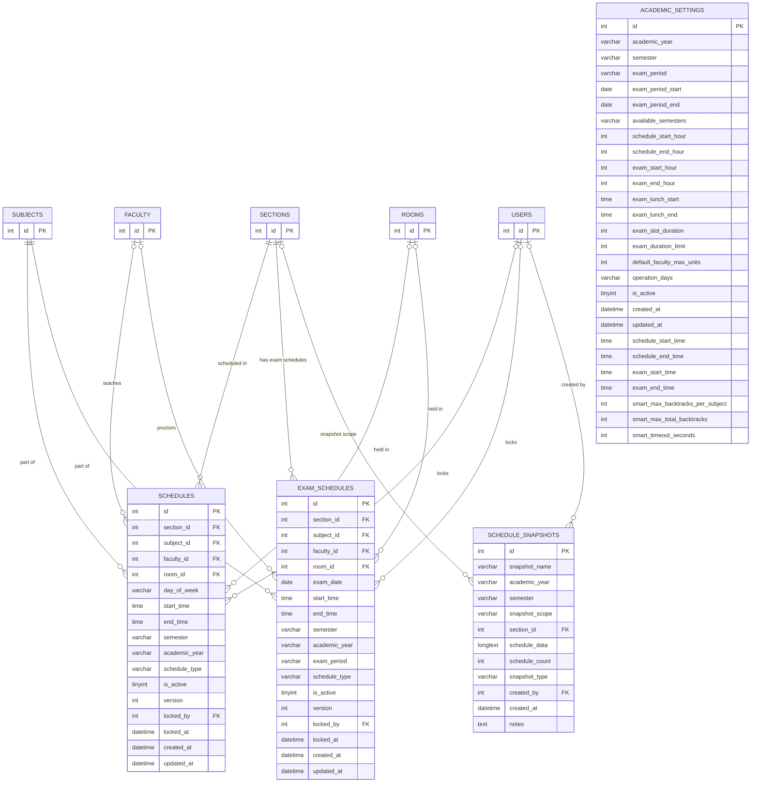
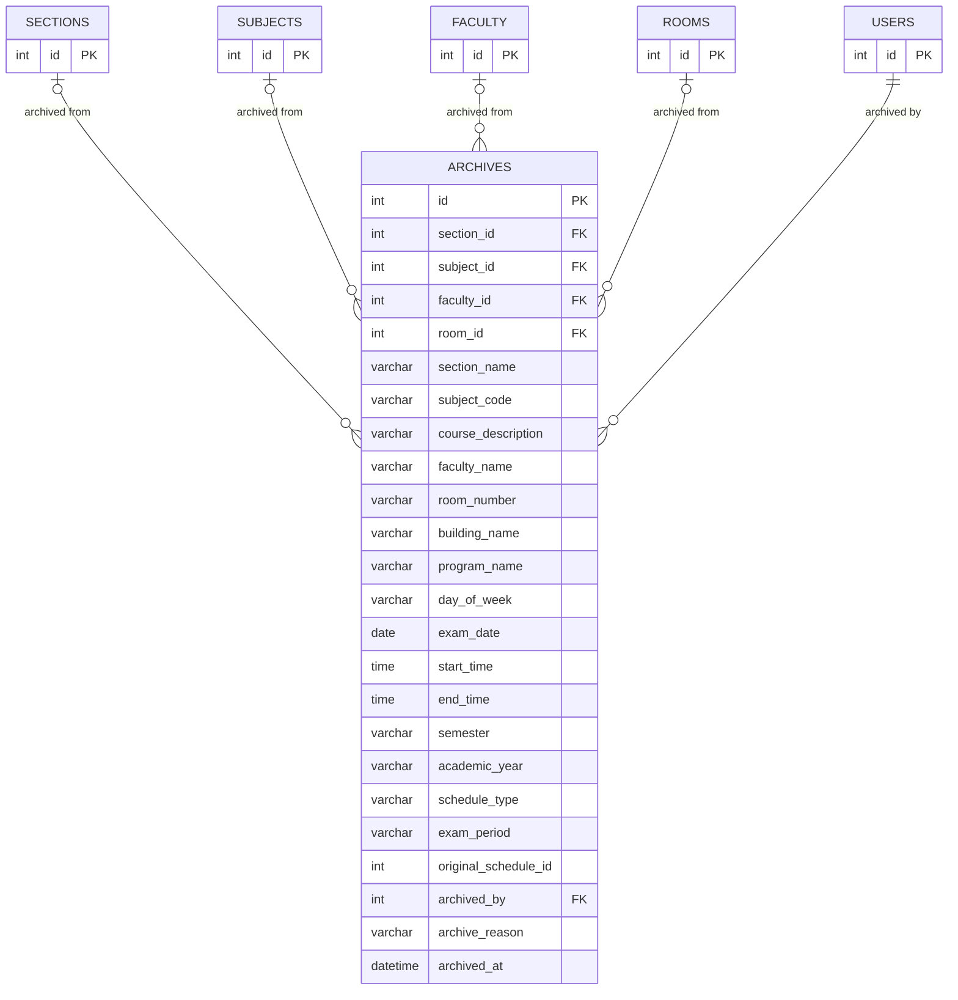
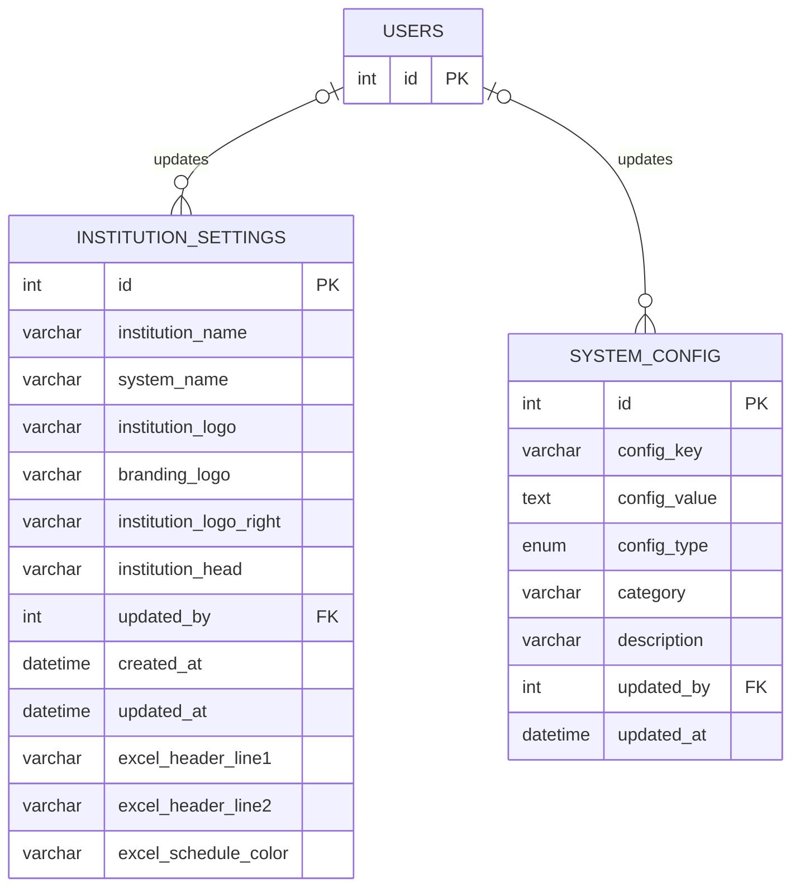

# Entity Relationship Diagram (ERD)
## iSchedWise V4 — School Scheduling System

> **Source of truth:** `ischedwise_db.sql`
>
> **Legend:** PK = Primary Key · FK = Foreign Key
>
> **See also:** [THESIS_ARCHITECTURE.md](THESIS_ARCHITECTURE.md) for client-server and container architecture views.

---

## Simplified ERD *(for thesis main body)*

> Shows entities, key attributes, and relationships only. Omits operational columns (`created_at`, `updated_at`, `ip_address`, etc.).

```mermaid
erDiagram

    USERS {
        int id PK
        varchar username
        varchar email
        varchar role
        tinyint is_active
        tinyint is_archived
        tinyint two_factor_enabled
    }
    LOGIN_HISTORY {
        int id PK
        int user_id FK
        datetime login_at
        datetime logout_at
    }
    USER_ACTIVITY_LOGS {
        int id PK
        int user_id FK
        varchar action
        varchar entity_type
    }
    TRUSTED_DEVICES {
        int id PK
        int user_id FK
        varchar label
        datetime expires_at
    }
    USER_PROGRAMS {
        int id PK
        int user_id FK
        int program_id FK
    }

    DEPARTMENTS {
        int id PK
        varchar department_name
        varchar department_code
    }
    PROGRAMS {
        int id PK
        varchar program_code
        varchar program_name
        int department_id FK
        tinyint is_archived
    }

    CURRICULA {
        int id PK
        varchar curriculum_code
        varchar curriculum_name
        int program_id FK
        tinyint is_archived
    }
    YEAR_LEVELS {
        int id PK
        int curriculum_id FK
        int year_number
        varchar year_name
    }
    SEMESTERS {
        int id PK
        int year_level_id FK
        varchar semester_name
    }
    SUBJECTS {
        int id PK
        int semester_id FK
        varchar subject_code
        varchar course_description
        decimal total_units
    }
    SECTIONS {
        int id PK
        int program_id FK
        varchar section_name
        int year_level
    }

    FACULTY {
        int id PK
        varchar last_name
        varchar first_name
        int department_id FK
        tinyint is_archived
    }
    FACULTY_AVAILABILITY {
        int id PK
        int faculty_id FK
        varchar day_of_week
        time start_time
        time end_time
    }
    FACULTY_SUBJECT_ASSIGNMENTS {
        int id PK
        int faculty_id FK
        int subject_id FK
        varchar academic_year
        varchar semester
    }

    BUILDINGS {
        int id PK
        varchar building_name
        tinyint is_archived
    }
    ROOMS {
        int id PK
        int building_id FK
        varchar room_number
        varchar room_type
    }

    ACADEMIC_SETTINGS {
        int id PK
        varchar academic_year
        varchar semester
        tinyint is_active
    }
    SCHEDULES {
        int id PK
        int section_id FK
        int subject_id FK
        int faculty_id FK
        int room_id FK
        varchar day_of_week
        time start_time
        time end_time
    }
    EXAM_SCHEDULES {
        int id PK
        int section_id FK
        int subject_id FK
        int faculty_id FK
        int room_id FK
        date exam_date
        varchar exam_period
    }
    SCHEDULE_SNAPSHOTS {
        int id PK
        varchar snapshot_name
        varchar snapshot_scope
        int section_id FK
        int created_by FK
        datetime created_at
    }

    ARCHIVES {
        int id PK
        int section_id FK
        int subject_id FK
        int faculty_id FK
        int room_id FK
        varchar academic_year
        varchar schedule_type
        int archived_by FK
    }

    INSTITUTION_SETTINGS {
        int id PK
        varchar institution_name
        varchar institution_head
    }
    SYSTEM_CONFIG {
        int id PK
        varchar config_key
        text config_value
        varchar category
    }

    USERS ||--o{ LOGIN_HISTORY : "has sessions"
    USERS ||--o{ USER_ACTIVITY_LOGS : "has logs"
    USERS ||--o{ TRUSTED_DEVICES : "has trusted devices"
    USERS ||--o{ USER_PROGRAMS : "assigned programs"
    DEPARTMENTS ||--o{ PROGRAMS : "has programs"
    DEPARTMENTS ||--o{ FACULTY : "employs"
    USERS |o--o{ PROGRAMS : "archives"
    PROGRAMS ||--o{ USER_PROGRAMS : "maps access"
    USERS |o--o{ BUILDINGS : "archives"
    PROGRAMS ||--o{ CURRICULA : "has curricula"
    PROGRAMS ||--o{ SECTIONS : "has sections"
    CURRICULA ||--o{ YEAR_LEVELS : "contains"
    YEAR_LEVELS ||--o{ SEMESTERS : "has semesters"
    SEMESTERS ||--o{ SUBJECTS : "contains subjects"
    USERS |o--o{ CURRICULA : "creates / archives"
    FACULTY ||--o{ FACULTY_AVAILABILITY : "has availability"
    FACULTY ||--o{ FACULTY_SUBJECT_ASSIGNMENTS : "has assignments"
    SUBJECTS ||--o{ FACULTY_SUBJECT_ASSIGNMENTS : "assigned to"
    USERS |o--o{ FACULTY : "archives"
    USERS |o--o{ FACULTY_AVAILABILITY : "creates"
    USERS |o--o{ FACULTY_SUBJECT_ASSIGNMENTS : "archives"
    BUILDINGS ||--o{ ROOMS : "contains rooms"
    SECTIONS ||--o{ SCHEDULES : "scheduled in"
    SUBJECTS ||--o{ SCHEDULES : "part of"
    FACULTY |o--o{ SCHEDULES : "teaches"
    ROOMS |o--o{ SCHEDULES : "held in"
    USERS |o--o{ SCHEDULES : "locks"
    SECTIONS ||--o{ EXAM_SCHEDULES : "has exams"
    SUBJECTS ||--o{ EXAM_SCHEDULES : "part of"
    FACULTY |o--o{ EXAM_SCHEDULES : "proctors"
    ROOMS |o--o{ EXAM_SCHEDULES : "held in"
    USERS |o--o{ EXAM_SCHEDULES : "locks"
    SECTIONS |o--o{ SCHEDULE_SNAPSHOTS : "snapshot scope"
    USERS |o--o{ SCHEDULE_SNAPSHOTS : "created by"
    SECTIONS |o--o{ ARCHIVES : "archived from"
    SUBJECTS |o--o{ ARCHIVES : "archived from"
    FACULTY |o--o{ ARCHIVES : "archived from"
    ROOMS |o--o{ ARCHIVES : "archived from"
    USERS ||--o{ ARCHIVES : "archived by"
    USERS |o--o{ INSTITUTION_SETTINGS : "updates"
    USERS |o--o{ SYSTEM_CONFIG : "updates"
```

---

## Full Physical ERD *(for thesis appendix)*

> Complete schema with all columns and data types, mirroring `ischedwise_db.sql` exactly.
> Split into 8 diagrams by logical group. Stub entries (id only) represent cross-group foreign key references.

---

### Diagram 1 — User & Authentication

---

### Diagram 2 — Organization

---

### Diagram 3 — Curriculum & Subjects

---

### Diagram 4 — Faculty

---

### Diagram 5 — Facilities

---

### Diagram 6 — Class & Exam Scheduling

---

### Diagram 7 — Archives

---

### Diagram 8 — System & Settings

