# iSchedWise V4 — System Flowcharts

> **Thesis Appendix C — Section 3.1: Flow Chart**
>
> Each flowchart represents one part of the system. Connector labels **(A1)**, **(A2)**, **(B)**, and **(C)** through **(K)** link flowcharts together — a connector output in one chart is the entry point of another.

---

## Table of Contents

| # | Flowchart | Connector |
|---|-----------|-----------|
| 1 | [Main Login Flow](#1-main-login-flow) | → **(A1)** Super Admin, **(A2)** Admin, **(B)** Dean |
| 2 | [Super Admin Dashboard](#2-super-admin-dashboard-connector-a1) | **(A1)** → **(C–K)** |
| 3 | [Admin Dashboard](#3-admin-dashboard-connector-a2) | **(A2)** → **(C–K)** |
| 4 | [Dean Dashboard](#4-dean-dashboard-connector-b) | **(B)** → **(C, D, E, F, G, H, I, K)** |
| 5 | [Schedule Management](#5-schedule-management-connector-c) | **(C)** |
| 6 | [Faculty Management](#6-faculty-management-connector-d) | **(D)** |
| 7 | [Building & Room Management](#7-building--room-management-connector-e) | **(E)** |
| 8 | [Programs & Sections Management](#8-programs--sections-management-connector-f) | **(F)** |
| 9 | [Curriculum & Subject Management](#9-curriculum--subject-management-connector-g) | **(G)** |
| 10 | [Reports Generation](#10-reports-generation-connector-h) | **(H)** |
| 11 | [System Settings](#11-system-settings-connector-i) | **(I)** |
| 12 | [User Management](#12-user-management-connector-j) | **(J)** |
| 13 | [Archive Management](#13-archive-management-connector-k) | **(K)** |
| 14 | [Password Reset](#14-password-reset-flow) | *(standalone)* |

---

## Connector Map

```
                        ┌─────────┐
                        │  LOGIN  │
                        └────┬────┘
                             │
              ┌──────────────┼──────────────┐
              ▼              ▼              ▼
            (A1)           (A2)           (B)
         Super Admin      Admin          Dean
                            │              │              │
        (C,D,E,F,G,H,I,J,K) (C,D,E,F,G,H,I,J,K) (C,D,E,F,G,H,I,K)
```

| Connector | Module | Super Admin | Admin | Dean |
|-----------|--------|:-----------:|:-----:|:----:|
| **(A1)** | Super Admin Dashboard | ✅ | — | — |
| **(A2)** | Admin Dashboard | — | ✅ | — |
| **(B)** | Dean Dashboard | — | — | ✅ |
| **(C)** | Schedule Management | ✅ | ✅ | ✅ |
| **(D)** | Faculty Management | ✅ | ✅ | ✅ |
| **(E)** | Building & Room Management | ✅ | ✅ | ✅ |
| **(F)** | Programs & Sections | ✅ | ✅ | ✅ |
| **(G)** | Curriculum & Subjects | ✅ | ✅ | ✅ |
| **(H)** | Reports Generation | ✅ | ✅ | ✅ |
| **(I)** | System Settings | ✅ | ✅ | ✅ |
| **(J)** | User Management | ✅ | ✅ | — |
| **(K)** | Archive Management | ✅ | ✅ | ✅ |

> Access table is entry-level access. Some modules include action-level restrictions (for example dean restrictions in selected Settings, Curriculum, Reports, and Archive actions). Super-admin system administration actions are now handled inside **Settings (I)**.

---

## 1. Main Login Flow

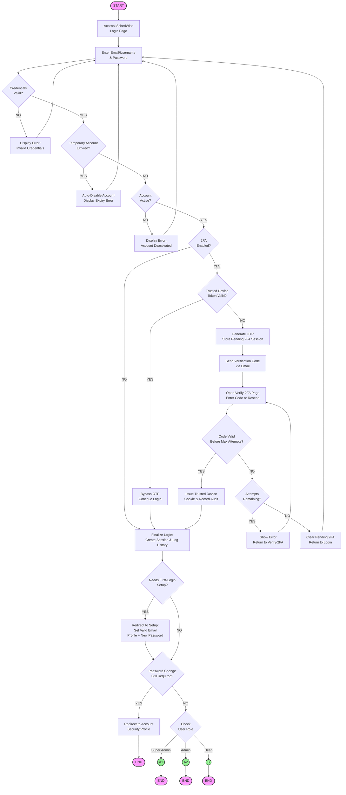

---

## 2. Super Admin Dashboard (Connector A1)

> **Super Admin implementation flow**: `/dashboard` immediately redirects to the dedicated superadmin command dashboard.

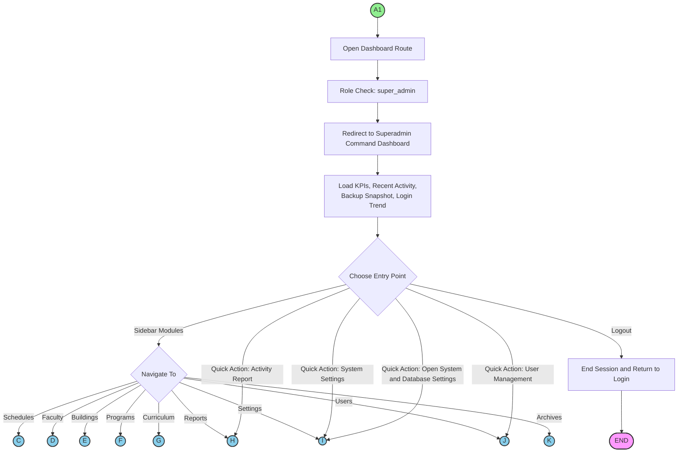

---

## 3. Admin Dashboard (Connector A2)

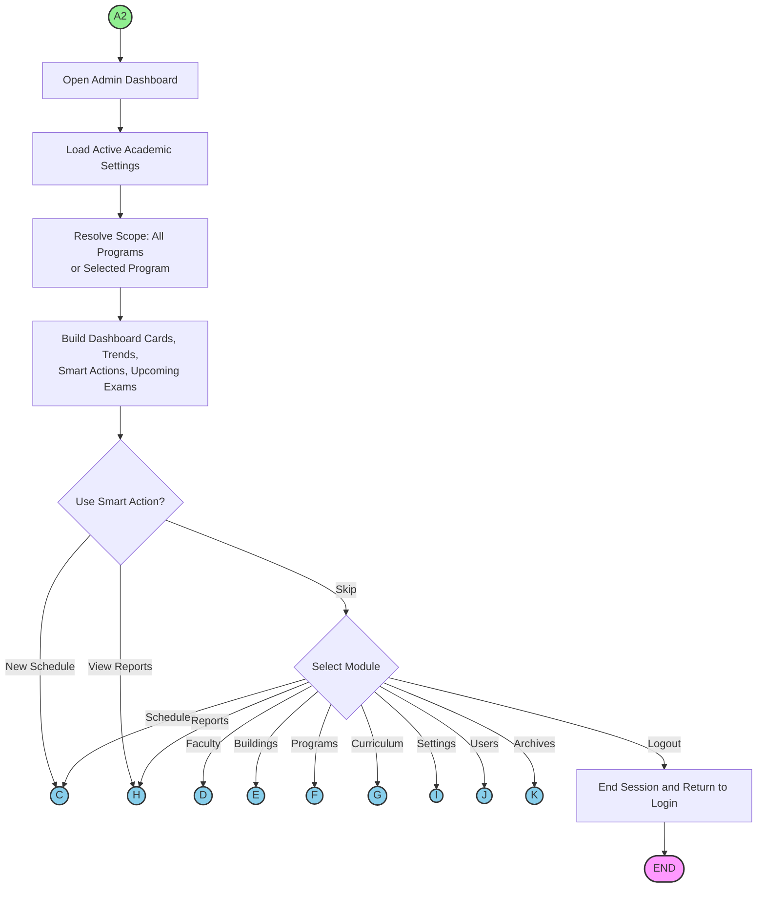

---

## 4. Dean Dashboard (Connector B)

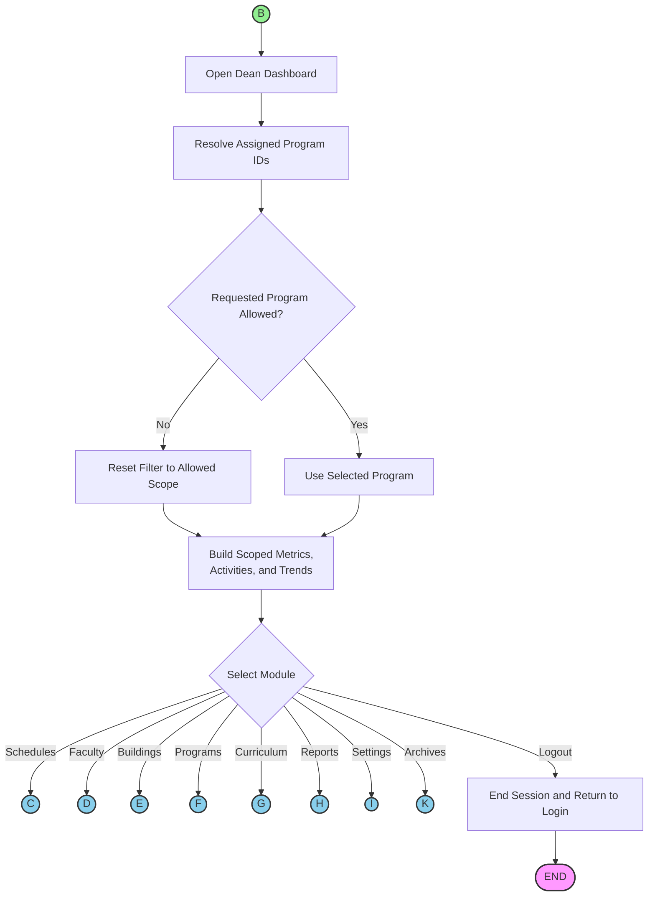

---

## 5. Schedule Management (Connector C)

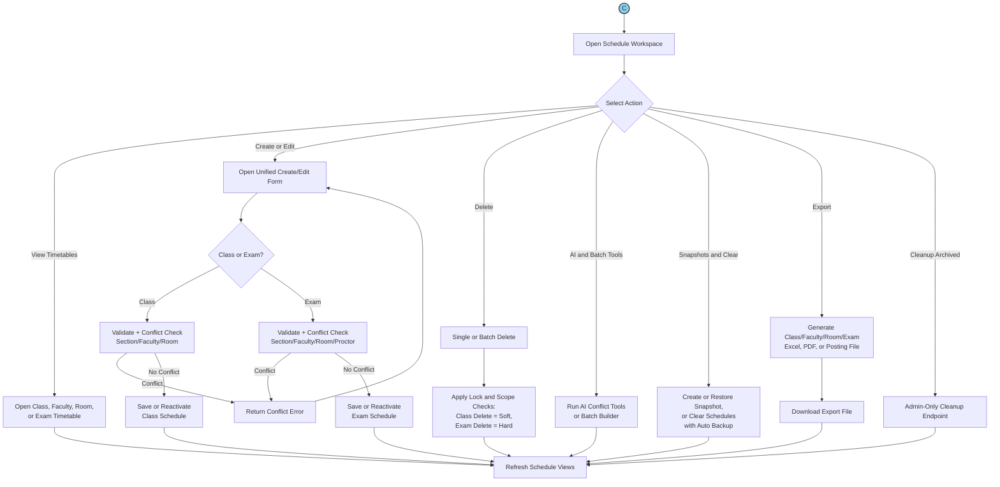

---

## 6. Faculty Management (Connector D)

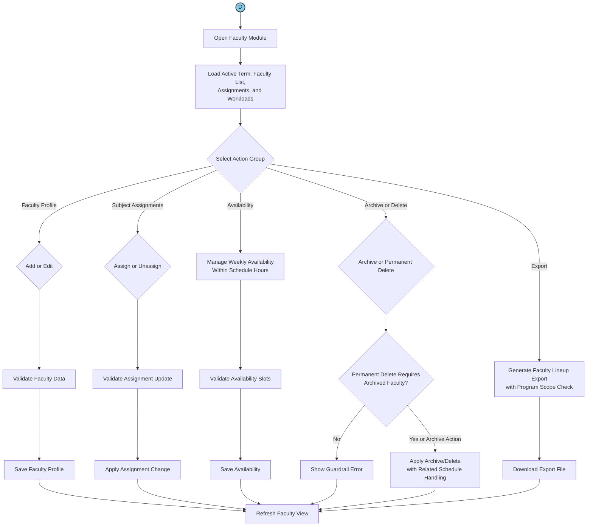

---

## 7. Building & Room Management (Connector E)

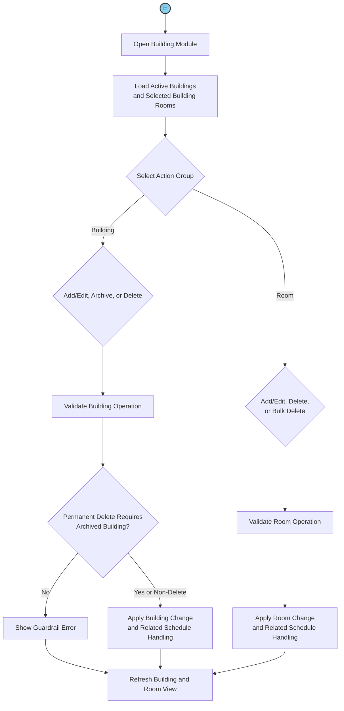

---

## 8. Programs & Sections Management (Connector F)

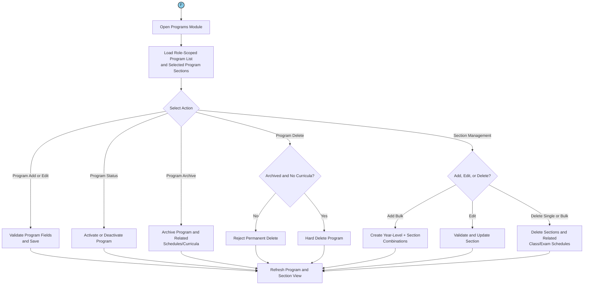

---

## 9. Curriculum & Subject Management (Connector G)

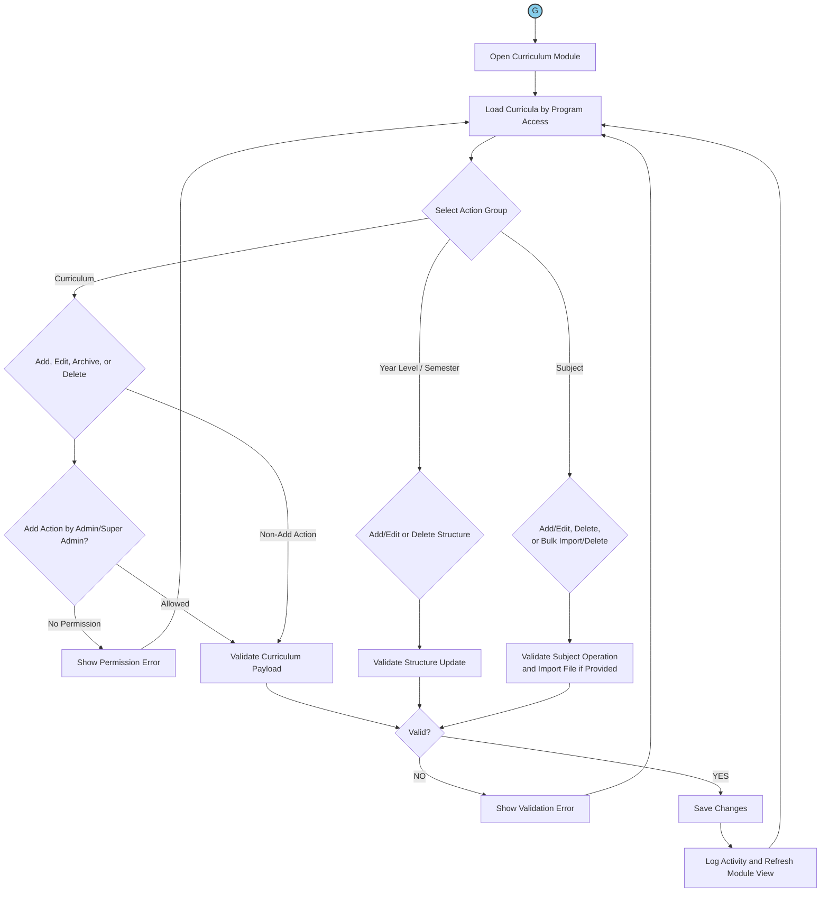

---

## 10. Reports Generation (Connector H)

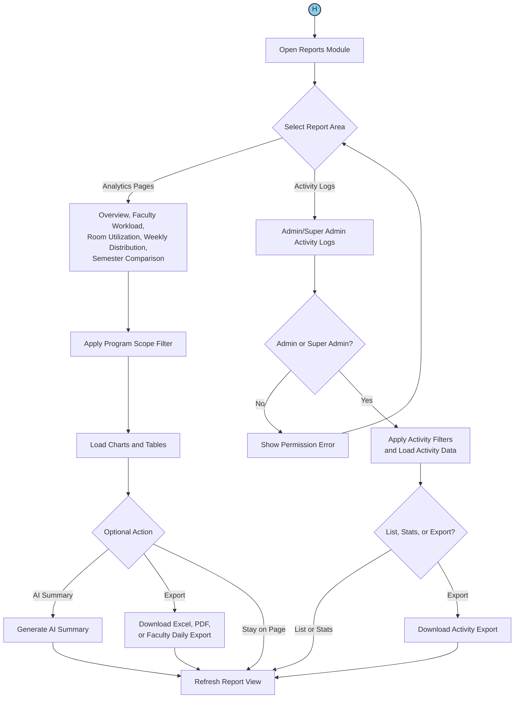

---

## 11. System Settings (Connector I)

> **All Authenticated Users Can Open Settings**
>
> **Admin/Super Admin:** full academic, institution, and department management actions
>
> **Super Admin:** additional system tab actions (maintenance mode, global branding, database tools, and security controls)
>
> **Dean:** department edit only (for assigned departments) plus personal preference updates

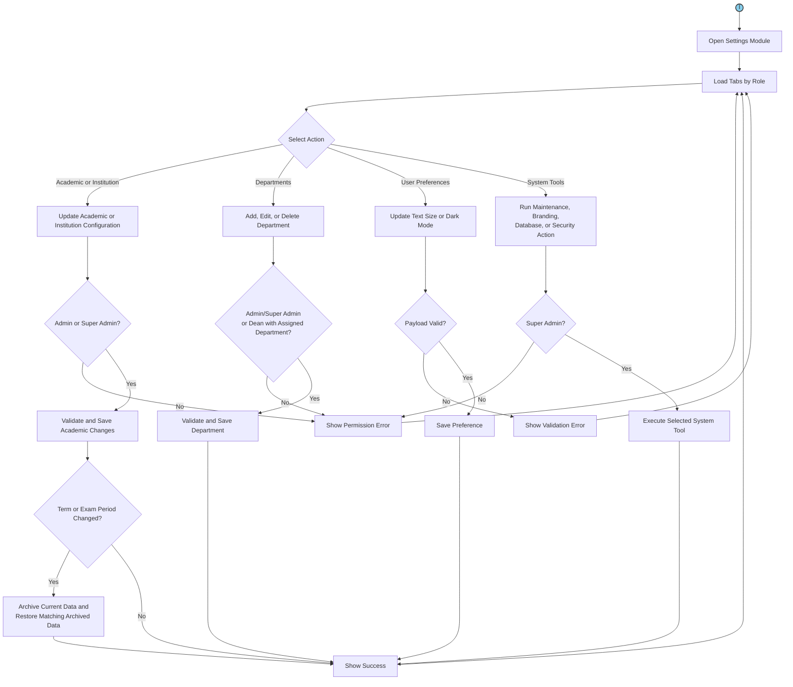

---

## 12. User Management (Connector J)

> **Admin & Super Admin** (selected actions are super-admin only)

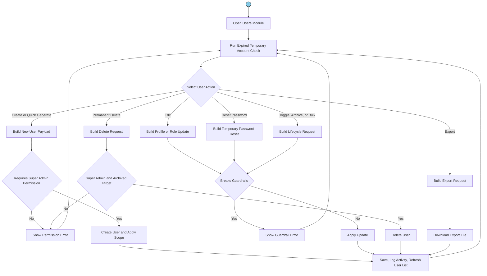

---

## 13. Archive Management (Connector K)

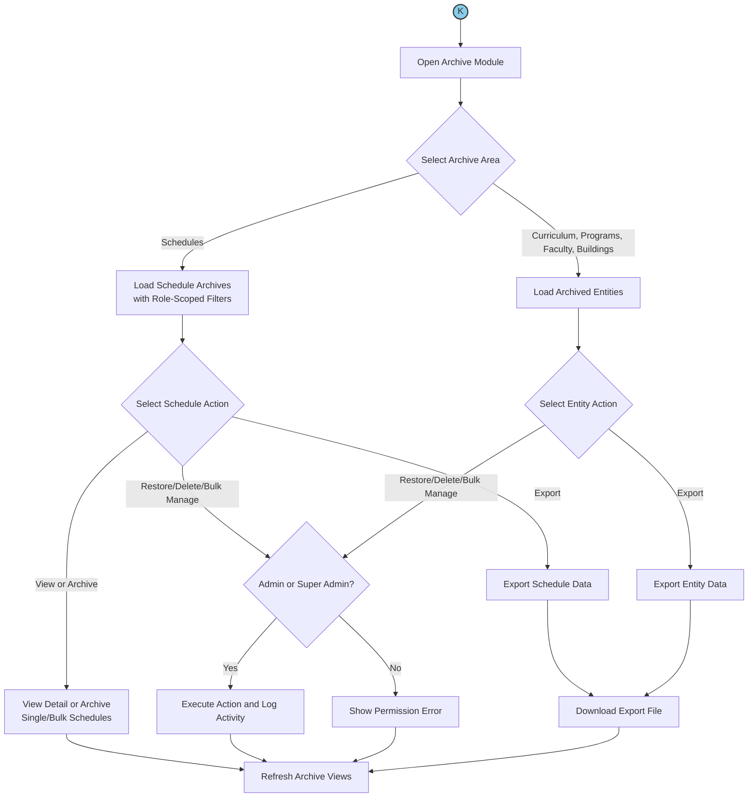

---

## 14. Password Reset Flow

> *(Standalone — accessible from Login page without authentication)*

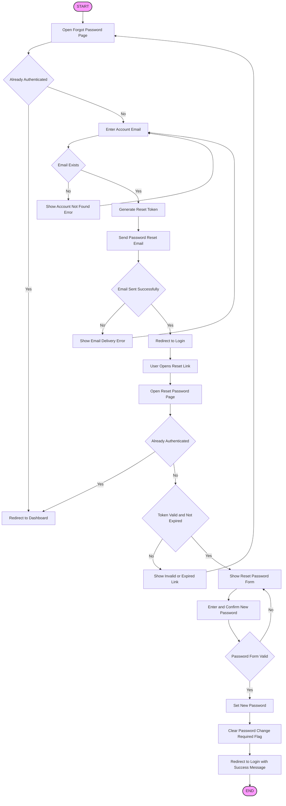

---

## Color Legend

| Shape / Color | Meaning |
|---------------|---------|
| 🟢 Green circle `(( ))` | Connector — links to another flowchart |
| 🔵 Blue circle `(( ))` | Connector — destination module |
| 🟪 Pink rounded `([ ])` | START / END terminal |
| ⬜ Rectangle `[ ]` | Process step |
| 🔷 Diamond `{ }` | Decision point |

---

*Generated for iSchedWise V4 — Thesis Appendix C, Section 3.1*
